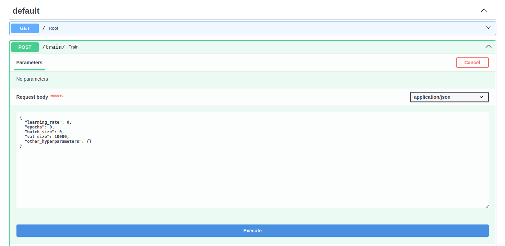
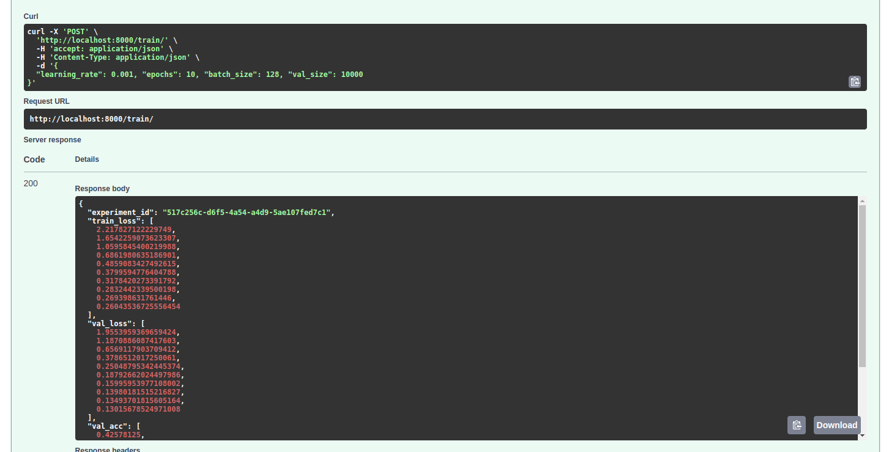

# Task
Goal: Develop an API service for training and serving a deep learning model for MNIST classification, integrated with a model registry and experiment tracking.

* Task: Design and Implement an API with three endpoints:

     * Train: \
          Receives hyperparameters and trains a deep neural network for MNIST classification. Logs training metrics and artifacts to a local experiment tracking server. Upon completion, returns information about the tracked experiment entry.
     * Register: \
          Receives a reference to a training experiment, exports the corresponding model to ONNX format, and promotes it to a model registry. May include some model governance processes before registering. Returns information about the registered model.

     * Predict: \
          Receives an image file,predicts the digit using the latest registered model, and returns the prediction result. 

# Introduction

There are three endpoints.

||train|register|predict|
|------|---|---|---|
|Method|POST|POST|POST|
|Input|hyperparameter(.json)|model path|image path|
|Output|Checkpoint file(.pth)|Information on the registered model (registrate, registration time, hyperparameters, data, etc.)|predict result and confidence|

# Installation

The package for this project is provided in requirements.txt.

## conda

```$conda create -n myenv python=3.9```
```$pip install -r requirements.txt```

## docker

To use the docker, you need to use the docker image. Build and run the image in the docker folder.
     ```$ docker built -t {image_name} .```
     ```$ docker run [OPTIONS] IMAGE[:TAG|@DIGEST] [COMMAND] [ARG...]```

Install the package using requirements.txt within the docker.
     ```# pip install -r requirements.txt```

# Quick Start

There are two ways to use this project.

1. Use curl.
2. Use Swagger API

## use curl
1. run main.py
   The server must always be running to run the following APIs.

2. endpoints
     * /train/  
          Run the train endpoint to train a CNN model for MNIST.
        To train the model, the user must enter hyperparameters, as shown below.

        example input:
        ```
        $ curl -X POST "http://0.0.0.0:8000/train/" \ 
          -H "Content-Type: application/json" \ 
          -d '{"learning_rate": 0.001, "epochs": 10, "batch_size": 128, "val_size": 10000}' 
        ```
          

     * /register/  
          To register a trained model with mlflow register endpoint.  \
             example input:

             $ curl -X POST "http://0.0.0.0:8000/register/" \ 
                  -H "Content-Type: application/json" \ 
                  -d '{"experiment_id": "123", "model_path": "path/to/model.pt"}'

     * /predict/  
          Run a prediction endpoint to predict your trained model.
        
        ```
        $ curl -X POST "http://0.0.0.0:8000/train/" \ 
        -H "Content-Type: application/json" \ 
        -d '{"learning_rate": 0.001, "epochs": 10, "batch_size": 128, "val_size": 10000}' 
        ```
        
## Or the swagger API provided.

1. run main.py
   The server must always be running to run the following APIs.

2. To use swagger refer to http://localhost:8000/docs
   Where the endpoint parameters are shown and we are able to upload new images and test the api.

* /train/
     * input_example
          
     * output_example
          

* /register/
  * input
  * output
* /prediction/
  * input
  * output

# mlflow

```$ mlflow ui```

# Reference

* CNN Base model:[](https://colab.research.google.com/github/divya-r-kamat/PyTorch/blob/master/MNIST_CNN_(Fine_Tuning).ipynb)

* Pipeline:
  * https://mlops-for-mle.github.io/tutorial/docs/intro
  * https://codereader.tistory.com/49
  * https://cow-coding.github.io/posts/day6_torch2/

* APIs example
  * https://github.com/afoley587/hosting-yolo-fastapi
  * https://github.com/KiLJ4EdeN/fastapi_tf-keras_example
  * https://github.com/woodywarhol9/hydra-practice

* lightning
  * https://velog.io/@rapidrabbit76/pytorch-lightning-hooks
  * https://baeseongsu.github.io/posts/pytorch-lightning-introduction/
  * https://lightning.ai/docs/pytorch/stable/deploy/production_advanced.html