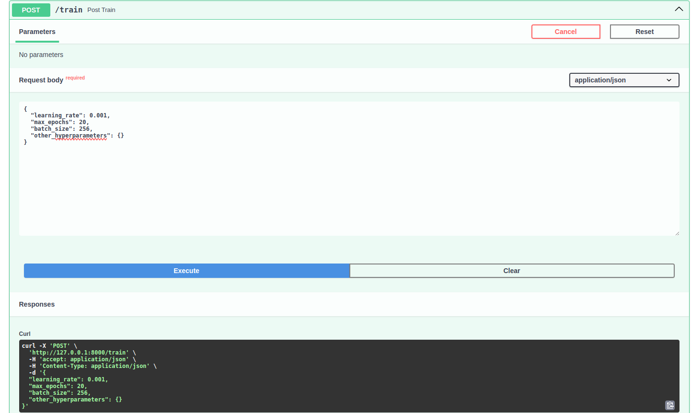
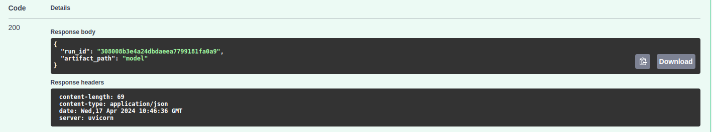
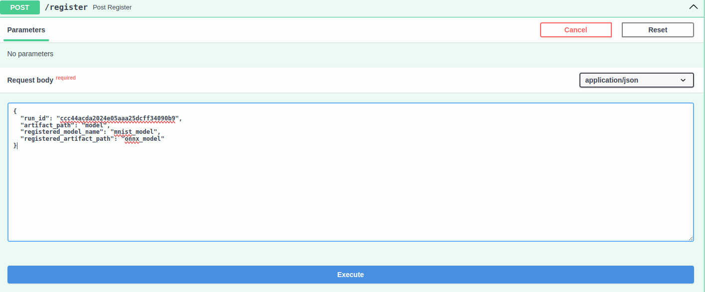
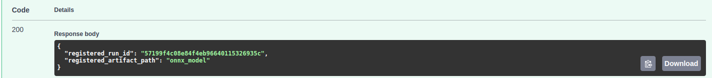
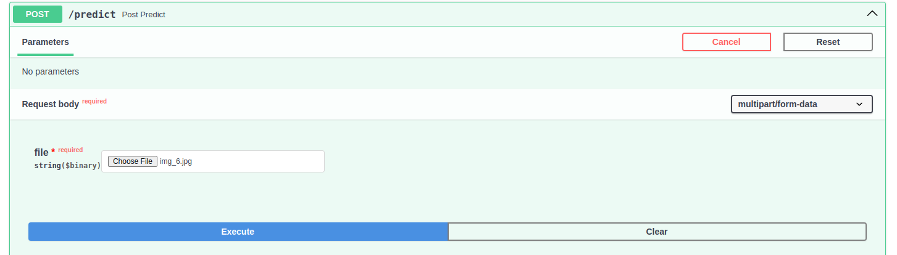
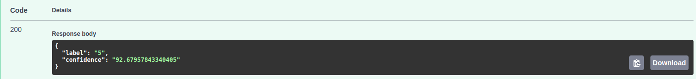

# Task

MNIST Classification API Service

## Goal

Develop an API service for training and serving a deep learning model for MNIST classification, integrated with a model registry and experiment tracking.

## Tasks

Design and Implement an API with three endpoints:

### Train

- **Description**:

  Receives hyperparameter and trains a deep neural network for MNIST classification.

- **Details**:
  - Logs training metrics and artifacts to a local experiment tracking server.
  - Upon completion, returns information about the tracked experiment entry.

### Register

- **Description**: Receives a reference to a training experiment, exports the corresponding model to ONNX format, and promotes it to a model registry.
- **Details**:
  - May include some model governance processes before registering.
  - Returns information about the registered model.

### Predict

- **Description**: Receives an image file, predicts the digit using the latest registered model, and returns the prediction result.

## Introduction

This API service is designed to streamline the training, registration, and prediction processes for a deep learning model focused on MNIST classification. The service features three primary endpoints, each serving a unique purpose in the model lifecycle.

### Endpoints Overview

| Endpoint | Method | Input                  | Output                                         |
| -------- | ------ | ---------------------- | ---------------------------------------------- |
| Train    | POST   | hyperparameters (json) | model ID, and experiment tracking information. |
| Register | POST   | model ID,artifact ID   | register ID                                    |
| Predict  | POST   | image                  | predicted digit and confidence score.          |

## Installation

### docker

1. To use the docker, you need to use the docker image. Build and run the image in the docker folder.

    ```bash
    $ docker build -t [IMAGE_NAME] .
    $ docker run [OPTIONS] IMAGE[:TAG|@DIGEST] [COMMAND] [ARG...]
    ```

2. Install the package using requirements.txt within the docker.

    ```
    # pip install -r requirements.txt
    ```

### conda

1. Create a virtual environment

    ```bash
    $ conda create -n mnist python=3.10
    $ conda activate mnist
    ```

2. Install the package

    ```bash
    $ pip install -r requirements.txt
    ```

## Quick Start

There are two ways to use this project.

1. Use docker-compose
2. Use curl
3. Use Swagger API

### docker-compose

1. localhost

    ```bash
    $ export IP_ADDRESS=localhost && \
      docker compose -f .devcontainer/docker-compose.yml up
    ```

2. setting host IP

    ```bash
    $ export IP_ADDRESS=[USER_IP] && \
      docker compose -f .devcontainer/docker-compose.yml up
    ```

### Use curl

1. endpoints
     - **/train/**
  Run the train endpoint to train a CNN model MNIST. To train the model, the user must enter hyper parameters, as shown below.

       - example input:

          ```bash
          $ curl -X POST "http://localhost:8000/train/" \
            -H "Content-Type: application/json" \
            -d '{"learning_rate": 0.001, "epochs": 10, "batch_size": 128, "val_size": 10000}'
          ```

     - /register/
          To register a trained model with mlflow register endpoint.
          - example input:

              ```bash
              $ curl -X POST "http://localhost:8000/register/" \
                -H "Content-Type: application/json" \
                -d '{ "run_id": "{run_id}", "artifact_path": "model", \
                "registered_model_name": "mnist_model", "registered_artifact_path": "onnx_model" }'
              ```

     - /predict/
          Run a prediction endpoint to predict your trained model.
          - example input:

              ```bash
              $ curl -X POST "http://localhost:8000/predict/" \
                -H "Content-Type: application/json" \
                -H 'Content-Type: multipart/form-data' \
                -F 'file=@{img_path};type=image/jpeg'
              ```

## Use swagger API

1. To use swagger refer to [http://localhost:8000/docs](http://localhost:8000/docs)
   where the endpoint parameters are shown and we are able to upload new images and test the api.

- /train/
     - input_example
          
     - output_example
          

- /register/
  - input
          
  - output
          
- /prediction/
  - input
          
  - output
          

## mlflow

```bash
$ mlflow ui -p 5000 -h [HOST_IP]
```

## Reference

- CNN Base model: [](https://colab.research.google.com/github/divya-r-kamat/PyTorch/blob/master/MNIST_CNN_(Fine_Tuning).ipynb)

- Pipeline:
  - [https://mlops-for-mle.github.io/tutorial/docs/intro](https://mlops-for-mle.github.io/tutorial/docs/intro)
  - [https://codereader.tistory.com/49](https://codereader.tistory.com/49)
  - [https://cow-coding.github.io/posts/day6_torch2/](https://cow-coding.github.io/posts/day6_torch2/)

- MLflow:
  - [https://mlflow.org/docs/latest/index.html](https://mlflow.org/docs/latest/index.html)

- APIs example:
  - [https://github.com/afoley587/hosting-yolo-fastapi](https://github.com/afoley587/hosting-yolo-fastapi)
  - [https://github.com/KiLJ4EdeN/fastapi_tf-keras_example](https://github.com/KiLJ4EdeN/fastapi_tf-keras_example)
  - [https://github.com/woodywarhol9/hydra-practice](https://github.com/woodywarhol9/hydra-practice)

- lightning:
  - [https://velog.io/@rapidrabbit76/pytorch-lightning-hooks](https://velog.io/@rapidrabbit76/pytorch-lightning-hooks)
  - [https://baeseongsu.github.io/posts/pytorch-lightning-introduction/](https://baeseongsu.github.io/posts/pytorch-lightning-introduction/)
  - [https://lightning.ai/docs/pytorch/stable/deploy/production_advanced.html](https://lightning.ai/docs/pytorch/stable/deploy/production_advanced.html)
